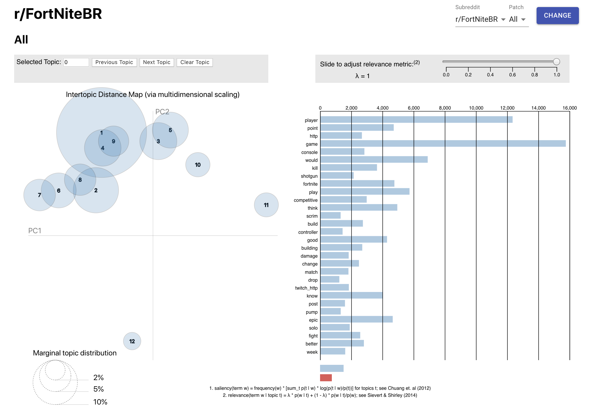

This project was bootstrapped with [Create React App](https://github.com/facebook/create-react-app). The resulting app is available on
[Github Pages](https://jeromecohen.github.io/fortnite/)

The dashboard allows the user to filter LDA visualizations by subreddit, either r/FortNiteBR (the casual community) or r/FortniteCompetitive, and Fortnite patch. Example below: 

## Run Locally
To recreate this app, cd into the cloned directory then run: 

`npm install`  

 `npm run` 

 The app should be hosted on port 3000. 

